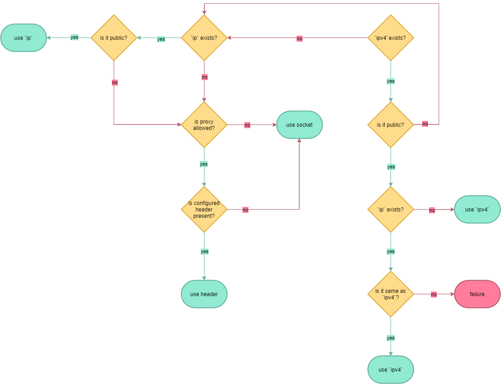

chihaya (kuroneko)
=======

Installation
-------------

chihaya requires Golang >= 1.19 and MariaDB >= 10.3.3.

```sh
go get
go build -v -o .bin/ ./cmd/...
```

Example systemd unit file:
```systemd
[Unit]
Description=chihaya
After=network.target mariadb.service

[Service]
WorkingDirectory=/opt/chihaya
ExecStart=/opt/chihaya/chihaya
RestartSec=30s
Restart=always
User=chihaya

[Install]
WantedBy=default.target
```

Alternatively, you can also build/use a docker container instead:

```sh
docker build . -t chihaya
docker run -d --restart=always --user 1001:1001 --network host --log-driver local -v ${PWD}:/app chihaya
```

Usage
-------------
Build process outputs several binary files. Each binary has its own flags, use 
`-h` or `--help` for detailed help on how to use them.

- `chihaya` - this is tracker itself
- `cc` - utility for manipulation of cache data
- `bencode` - utility for encoding and decoding between JSON and Bencode

Chihaya does not support keep-alive or TLS and is designed to be used behind reverse proxy (such as `nginx`) that can
provide all of these features.

Usage of compression (such as `gzip`) is dicouraged as responses are usually quite small (especially when `compact` 
is requested), resulting in unnecessary overhead for zero gain.

Configuration
-------------

Configuration is done in `config.json`, which you'll need to create with the following format:

```json
{
  "database": {
    "dsn": "chihaya:@tcp(127.0.0.1:3306)/chihaya",
    "deadlock_pause": 1,
    "deadlock_retries": 5
  },

  "channels": {
    "torrent": 5000,
    "user": 5000,
    "transfer_history": 5000,
    "transfer_ips": 5000,
    "snatch": 25
  },

  "intervals": {
    "announce": 1800,
    "min_announce": 900,
    "peer_inactivity": 3900,
    "announce_drift": 300,
    "scrape": 900,

    "database_reload": 45,
    "database_serialize": 68,
    "purge_inactive_peers": 120,

    "flush": 3
  },

  "http": {
    "addr": ":34000",
    "admin_token": "",
    "proxy_header": "",
    "timeout": {
      "read": 300,
      "write": 500,
      "idle": 30
    }
  },
  
  "announce": {
    "strict_port": false,
    "numwant": 25,
    "max_numwant": 50
  },
  
  "record": false,
  "scrape": true,
  "log_flushes": true
}
```

- `database`
    - `dsn` - data source name at which to find database
    - `deadlock_pause` - time in seconds to wait between retries on deadlock, ramps up linearly with each attempt from this value
    - `deadlock_retries` - how many times should we retry on deadlock
- `channels` - channel holds raw data for injection to SQL statement on flush
    - `torrent` - maximum size of channel holding changes to `torrents` table
    - `user` - maximum size of channel holding changes to `users_main` table
    - `transfer_history` - maximum size of channel holding changes to `transfer_history`
    - `transfer_ips` - maximum size of channel holding changes to `transfer_ips`
    - `snatch`: maximum size of channels holding snatches for `transfer_history`
- `intervals` - all values are in seconds
    - `announce` - default announce `interval` given to clients
    - `min_announce` - minimum `min_interval` between announces that clients should respect
    - `peer_inactivity` - time after which peer is considered dead, recommended to be `(min_announce * 2) + (announce_drift * 2)`
    - `announce_drift` - maximum announce drift to incorporate in default `interval` sent to client
    - `scrape` - default scrape `interval` given to clients
    - `database_reload` - time between reloads of user and torrent data from database
    - `database_serialize` - time between database serializations to cache
    - `purge_inactive_peers` - time between peers older than `peer_inactivity` are flushed from database and memory
    - `flush` - time between database flushes when channel is used in less than 50%
- `http` - HTTP server configuration
    - `addr` - address on which we should listen for requests
    - `admin_token` - administrative token used in `Authorization` header to access advanced prometheus statistics
    - `proxy_header` - header name to look for user's real IP address, for example `X-Real-Ip`
    - `timeout`
      - `read` - timeout in _milliseconds_ for reading request
      - `write` - timeout in _milliseconds_ for writing response (per write operation)
      - `idle` - how long (in _seconds_) to keep connection open for keep-alive requests
- `announce`
    - `strict_port` - if enabled then announces where client advertises port outside range `1024-65535` will be failed
    - `numwant` - Default number of peers sent on announce if otherwise not explicitly specified by client
    - `max_numwant` - Maximum number of peers that tracker will send per single announce, even if client requests more
- `record` - enables or disables JSON recorder of announces
- `scrape` - enables or disables `/scrape` endpoint which allows clients to get peers count without sending announce
- `log_flushes` - whether to log all database flushes performed

Recorder
-------------

If `record` is true, chihaya will save all successful announce events to a file under 
`events` directory. The files will have a format of `events_YYYY-MM-DDTHH.csv` and are
split hourly for easier analysis.

Database scheme
-------------
Supported database scheme can be located in `database/schema.sql`.

Example data from fixtures can be consulted for additional help.

Flowcharts
-------------

#### IP resolve

